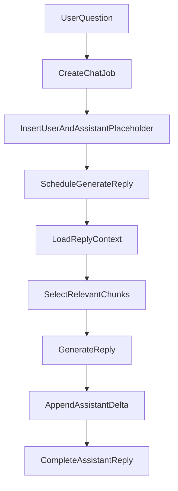
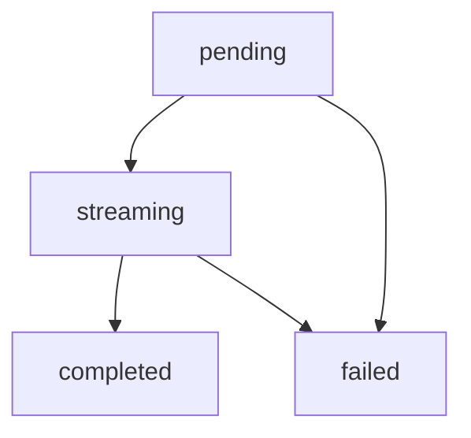
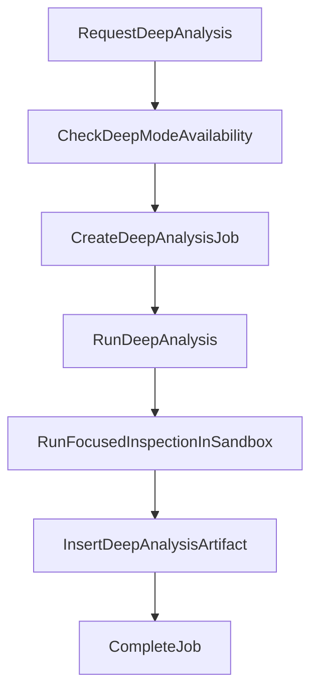

# Chat And Analysis Pipeline

## Purpose

This document describes the two AI interaction paths currently available in Repospark:

- Quick chat
- Deep analysis

Both are repository-centered, but they depend on different data sources and execution models.

## Differences Between the Two Paths

| Capability               | Quick chat                                           | Deep analysis                               |
| ------------------------ | ---------------------------------------------------- | ------------------------------------------- |
| Main entry point         | `chat.sendMessage`                                   | `analysis.requestDeepAnalysis`              |
| Primary data source      | `analysisArtifacts` + `repoChunks` + recent messages | live sandbox                                |
| Execution location       | Convex action                                        | Convex Node action + Daytona                |
| UI presentation          | streaming updates to thread messages                 | a new deep-analysis artifact plus job state |
| Availability requirement | repository has completed import                      | repository has a usable sandbox             |

## Chat Flow

### 1. The user sends a message

When `sendMessage` is called, the system first verifies:

- the thread exists
- the repository for that thread exists
- the repository owner matches the current signed-in user

It then creates three core records:

- one `chat` job
- one user message
- one assistant placeholder message

The assistant placeholder starts as:

- `role = assistant`
- `status = pending`
- `content = ""`

This allows the UI to immediately show a reply that is waiting to be generated.

### 2. Generate the assistant reply in the background

`internal.chat.generateAssistantReply` takes over the rest of the flow. It starts by:

- marking the assistant message as `streaming`
- marking the job as `running`

### 3. Build the reply context

`getReplyContext` assembles the reply context from three major sources:

- repository-level summaries
- import artifacts plus recent deep-analysis artifacts
- `repoChunks` associated with the latest import
- recent conversation messages

That means Quick chat does not read the whole repository directly. It reads the repository's already-processed knowledge layer.

### 4. Select chunks

The chat pipeline uses tokens from the user's question to score chunk paths and summaries and pick the most relevant fragments.

This is not a full RAG ranking pipeline. It is a lightweight relevance selector whose main goals are:

- reducing prompt size
- improving answer focus

### 5. Generate the answer

If `OPENAI_API_KEY` exists, the system:

- uses `streamText`
- selects `OPENAI_MODEL` or falls back to `gpt-4o-mini`
- builds a prompt from artifacts, chunks, and the user question

If `OPENAI_API_KEY` is absent, the system falls back to a heuristic answer so it can still produce a response based on indexed data.

### 6. Stream and complete

The answer is not written all at once after generation finishes. Instead:

1. model output is accumulated
2. a delta is appended whenever content grows past `STREAM_FLUSH_THRESHOLD`
3. the final remaining content is written and the reply is marked completed

When the flow completes, it updates:

- the assistant message `status = completed`
- `thread.lastAssistantMessageAt`
- the job `status = completed`

If an error occurs midstream, both the assistant message and the job are marked failed.

## Message state model

The assistant reply state transition is roughly:

This state model lets the UI faithfully represent four different states: created-but-not-yet-answered, answering, answered, and failed.

## Deep Analysis Flow

### 1. Request deep analysis

`requestDeepAnalysis` first checks:

- that the repository belongs to the current signed-in user
- that `latestSandboxId` exists
- that the sandbox state allows deep mode

If the sandbox is unavailable, the mutation throws immediately instead of creating an analysis workflow that cannot run.

### 2. Create the job

After validation passes, the system creates:

- one `deep_analysis` job
- and points `repository.latestAnalysisJobId` to it

### 3. Run focused inspection inside the sandbox

`analysisNode.runDeepAnalysis`:

- marks the job as running
- checks sandbox availability again
- calls `runFocusedInspection(remoteSandboxId, repoPath, prompt)`

This inspection is not a large direct LLM analysis over the whole repository. It first finds more relevant file paths inside the sandbox based on the prompt, then produces a focused inspection log.

### 4. Persist the artifact

The analysis result is ultimately written as:

- `analysisArtifacts.kind = deep_analysis`
- `source = sandbox`

That means deep analysis output does not exist only at execution time. It becomes reusable repository knowledge for later flows.

## Deep Mode Availability

The biggest difference between deep mode and Quick chat is that deep mode depends on a live sandbox. If the sandbox:

- has passed its TTL
- is archived
- has failed
- is missing required remote path information

then deep mode becomes unavailable.

The frontend `ChatPanel` also uses this state to tell the user to:

- sync the repository to provision a new sandbox
- or switch back to Quick mode

## How The Two Pipelines Complement Each Other

Quick chat and Deep analysis are not mutually exclusive. They form two layers of analysis capability:

- Quick chat: fast, inexpensive, and mostly based on indexed knowledge
- Deep analysis: slower and sandbox-dependent, but able to add observations closer to the live repository state

Artifacts produced by deep analysis flow back into later chat context, so the overall system forms a cumulative knowledge loop.

## Known Limitations

- Quick chat currently uses a lightweight chunk-ranking approach and does not yet implement a richer semantic retrieval layer.
- Chat and deep analysis are both AI features, but their outputs and tracking models are still split between thread replies and artifacts.
- Deep analysis is currently closer to focused file discovery plus a markdown report than to a full agentic repository-reasoning pipeline.

