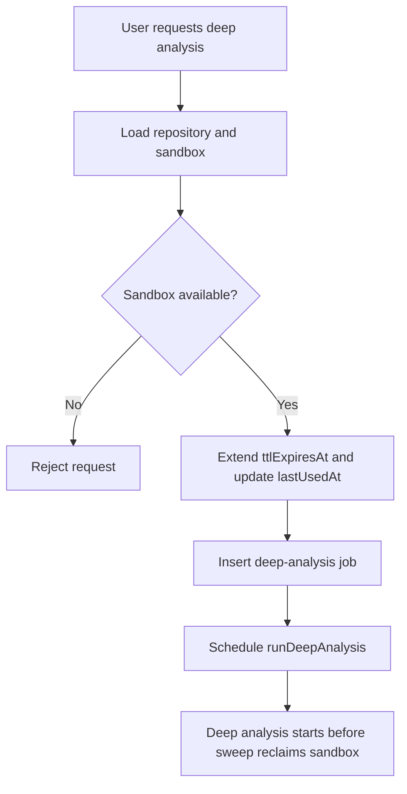
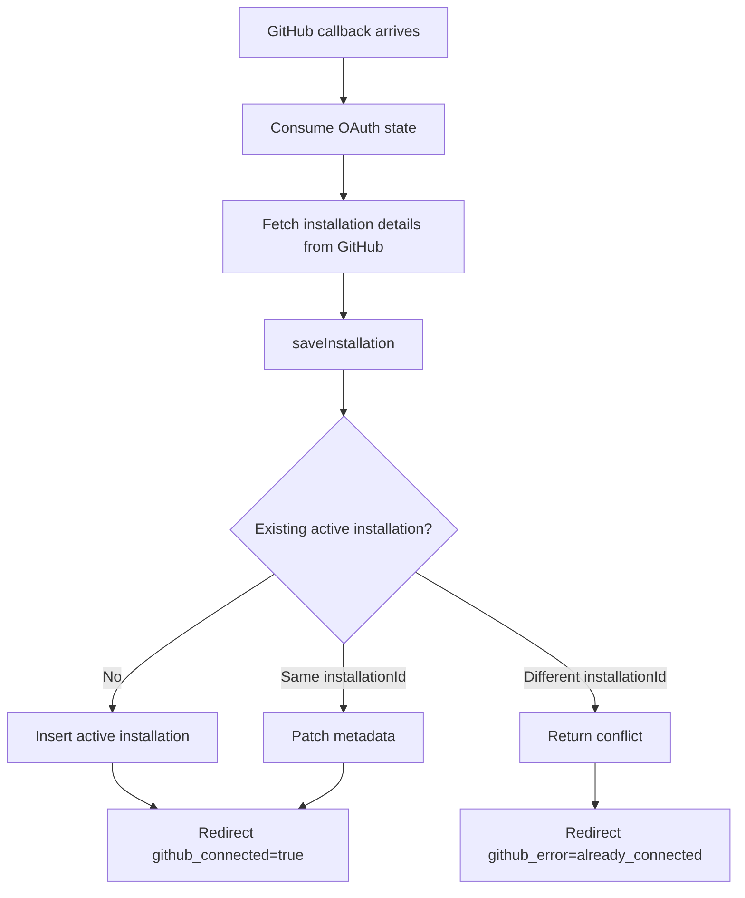
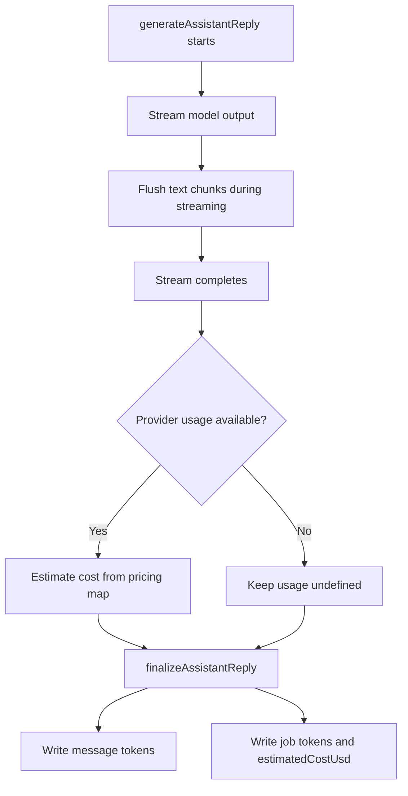

# Deep Analysis, Installation Conflict, and Cost Tracking

## Purpose

This document explains the system-design choices behind three small but related improvements:

1. keep a sandbox alive long enough for deep analysis to start
2. make GitHub installation conflicts explicit instead of silently overwriting state
3. persist chat token usage and estimated cost without making the main reply path fragile

They are grouped together because all three sit on important product boundaries:

- sandbox lifetime and cost
- external account ownership
- AI usage observability

## Design Goals

The design is intentionally conservative.

1. extend sandbox lifetime only when the sandbox will actually be used
2. preserve the current single-installation product model
3. treat provider-reported usage as optional observability, not as a required control-plane input
4. avoid broad API or UI churn for what should stay a small plan

## 1. Deep Analysis TTL Protection

### Problem

`requestDeepAnalysis` creates a job first, then the background action starts later.
If the sandbox TTL is about to expire, the hourly sweep can stop or archive the sandbox before the deep-analysis action actually begins.

That creates a bad user experience:

1. the request is accepted
2. the job is queued
3. the sandbox expires
4. the job fails almost immediately

### Chosen Design

When the user requests deep analysis, the system extends the sandbox TTL in the same mutation transaction before the action is scheduled.

That keeps the fix small and keeps the protection exactly where the real sandbox-consuming workflow begins.

### Why Chat Does Not Extend TTL

The current chat `deep` or `thorough` mode does not read the live sandbox.
It still answers from imported artifacts, chunks, and recent messages.

Because of that, extending sandbox TTL from `sendMessage` would increase cost without improving correctness.

### Flow

## 2. GitHub Installation Conflict Handling

### Problem

Today the callback path can silently overwrite one active GitHub installation with another one for the same owner.

That looks successful in the UI, but it changes which repositories the system can access.

The current product shape is still single-installation:

- one connection status in the UI
- one installation ID used by repo access checks
- one "manage access" link

So full multi-installation support is not a small backend-only change.

### Chosen Design

Keep the current invariant:

> one owner can have at most one active GitHub installation

If the callback returns the same installation again, update metadata.
If it returns a different active installation, treat that as a product conflict and redirect with a clear error.

This keeps the public API and UI stable while removing silent state corruption.

### Flow

## 3. Chat Usage and Cost Tracking

### Problem

The schema already has fields for tokens and estimated cost, but the chat pipeline never writes them.

That means the system has no stored per-reply usage signal for later reporting or budgeting.

### Chosen Design

Write usage only when the provider gives a finalized token count.

The flow should stay tolerant:

- if usage exists, persist it
- if pricing is missing for a model, leave cost empty
- if the fallback path is used, leave all usage fields empty

This keeps observability useful without turning chat completion into a pricing-table dependency.

### Flow

## Invariants

These changes should preserve four simple rules:

1. sandbox TTL is only extended on a path that actually consumes the sandbox
2. each owner still has at most one active GitHub installation
3. usage tracking never blocks a successful assistant reply
4. unknown pricing data is a missing-observability case, not a runtime failure

## What This Design Does Not Do

- it does not add full multi-installation support
- it does not make chat `deep` mode sandbox-backed
- it does not add cost dashboards or reports
- it does not turn token usage into rate limiting or budgeting yet

## Follow-Up Direction

If the product later wants richer behavior, there are two clean next steps:

1. a dedicated multi-installation plan that updates backend APIs, UI state, and installation selection UX together
2. a real sandbox-backed chat mode, at which point TTL extension can move into a shared helper for all sandbox-consuming flows
