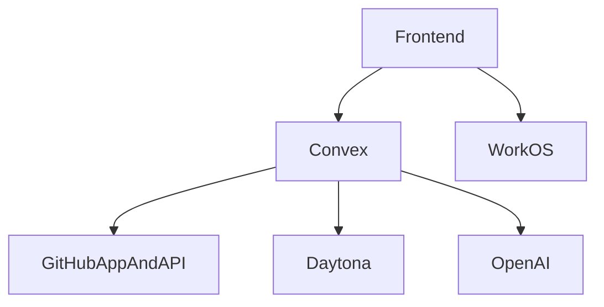
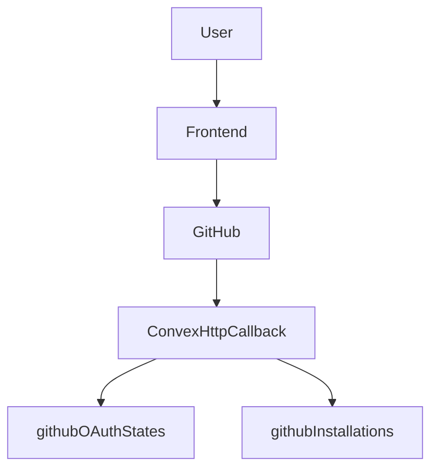

# Integrations And Operations

## Purpose

This document consolidates Repospark's integration boundaries with external systems and the current operational design around runtime behavior, cleanup, and deployment.

## External Integration Overview

## WorkOS

### Role

WorkOS provides the browser-side sign-in experience and access token. Repospark does not issue its own app tokens. Instead, it hands the WorkOS token to Convex for validation.

### Boundary

- the frontend uses `VITE_WORKOS_CLIENT_ID` and `VITE_WORKOS_REDIRECT_URI`
- the backend uses `WORKOS_CLIENT_ID` to construct the custom JWT issuer and JWKS configuration

This gives the frontend and backend cleanly separated responsibilities:

- the frontend owns sign-in interaction
- Convex owns token validation

## GitHub App

The GitHub App is the core external dependency for repository access control.

### Main capabilities

- start the installation flow
- obtain installation access tokens
- verify repository access
- list repositories visible to the installation
- receive installation lifecycle webhooks

### Callback flow

The actual flow is:

1. The user starts GitHub App installation from the frontend.
2. The backend creates a random state and stores it in `githubOAuthStates`.
3. GitHub redirects to `/api/github/callback` after installation.
4. The callback consumes the state and resolves the owner.
5. The callback fetches installation details from GitHub.
6. `githubInstallations` is upserted into an active installation record.

### Webhook flow

`/api/github/webhook` currently handles installation lifecycle events such as:

- `deleted`
- `suspend`
- `unsuspend`

The webhook first verifies the payload with HMAC-SHA256 using `GITHUB_APP_WEBHOOK_SECRET`, then updates local installation state.

### Design points

- installation tokens are used instead of user personal access tokens
- both callback and webhook handling are centralized in Convex `http.ts`
- local `githubInstallations` records are a projection of GitHub permission state, not the sole source of truth

## Daytona

Daytona provides the executable sandbox for repositories and is the core infrastructure behind import and deep analysis.

### Daytona's role in the system

- provision sandboxes
- clone repositories
- list file trees
- download important file contents
- run focused inspection
- stop and delete sandboxes

### Sandbox resource model

Each sandbox is created with:

- CPU, memory, and disk configuration
- auto-stop, auto-archive, and auto-delete intervals
- `repoPath`
- `remoteId`

The Convex `sandboxes` table stores the local projection of the Daytona runtime so the system can:

- determine deep mode availability
- display sandbox summaries
- execute later cleanup flows

### Why import stops instead of immediately deleting the sandbox

After import finishes, the system stops the sandbox instead of deleting it immediately because:

- indexed data has already been persisted into Convex, so continuous CPU use is unnecessary
- deep analysis may still need a live repository environment
- Daytona can automatically wake the sandbox on later access

This is Repospark's trade-off between cost and functionality.

## Sandbox Cleanup And Cron

### User- and system-triggered cleanup jobs

When a repository is deleted, or when the system proactively needs to clean up a sandbox, it creates a `cleanup` job that is ultimately handled by `opsNode.runSandboxCleanup`:

- first delete the Daytona sandbox
- then mark the local sandbox record as `archived`
- finally complete the cleanup job

### Hourly sweep of expired sandboxes

`crons.ts` runs `sweepExpiredSandboxes` every hour. The job is not just about deletion. Its responsibility is reconciliation:

- if Daytona already reports the sandbox as archived or destroyed, the DB is marked archived
- if Daytona reports the sandbox as stopped, the system proactively deletes it
- if Daytona still reports it as started, the system stops it first and deletes it on the next cycle

That means cleanup logic considers:

- real Daytona state
- local Convex state
- TTL and cost control

## OpenAI

### Role

OpenAI is currently used mainly for Quick chat response generation. If `OPENAI_API_KEY` is absent, the system falls back to a heuristic answer.

### Design implications

- OpenAI improves answer quality, but it is not the only requirement for product usability
- the real repository knowledge source still lives in Convex artifacts and chunks
- this fallback design preserves baseline usability even when the external model is unavailable

## Environment Variable Layers

### Frontend `.env`

These values are exposed to the browser:

- `VITE_CONVEX_URL`
- `VITE_WORKOS_CLIENT_ID`
- `VITE_WORKOS_REDIRECT_URI`

### Convex runtime env

These values must exist in the Convex environment, not frontend `.env.local`:

- `WORKOS_CLIENT_ID`
- `GITHUB_APP_ID`
- `GITHUB_APP_SLUG`
- `GITHUB_APP_PRIVATE_KEY`
- `GITHUB_APP_WEBHOOK_SECRET`
- `SITE_URL`
- `OPENAI_API_KEY`
- `OPENAI_MODEL`
- `DAYTONA_API_KEY`
- `DAYTONA_API_URL`
- `DAYTONA_TARGET`
- `DAYTONA_AUTO_STOP_MINUTES`
- `DAYTONA_AUTO_ARCHIVE_MINUTES`
- `DAYTONA_AUTO_DELETE_MINUTES`
- `DAYTONA_CPU_LIMIT`
- `DAYTONA_MEMORY_GIB`
- `DAYTONA_DISK_GIB`
- `DAYTONA_NETWORK_ALLOW_LIST`

### Why this split matters

- the frontend receives only public configuration
- sensitive credentials remain only in the Convex runtime
- GitHub, Daytona, and OpenAI secrets never leak into the frontend bundle

## Minimal Deployment Model

The minimum deployment structure implied by the current codebase is:

- frontend: a static site built from Vite
- backend: Convex cloud
- external dependencies: WorkOS, GitHub, Daytona, and OpenAI

In other words, Repospark does not require another always-on API server. Convex already fills the roles of application backend, scheduler, HTTP endpoint host, and database.

## Observations And Limitations

### Strengths

- External dependency boundaries are clear, and GitHub, Daytona, and OpenAI each have an explicit Node-side integration layer.
- Cleanup uses both jobs and cron, which balances proactive deletion with passive reconciliation.
- Environment-variable layering is clear, so sensitive credentials are not directly exposed to the frontend.

### Known limitations

- Both webhook and callback handling depend on Convex HTTP routes, so if integrations grow later, the system may need a clearer integration-module split.
- Daytona cleanup is one of the most important cost-control paths, and failed sweeps can leave resources around temporarily.
- OpenAI is currently used mostly for chat, while the analysis pipeline is still centered on sandbox inspection, so the two paths have not yet converged into a single agent framework.
