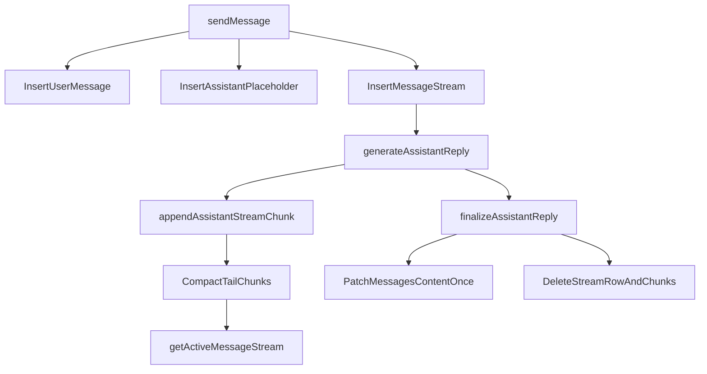

# Plan 07 - Long-Term Chat Streaming Architecture

- **Priority**: P2
- **Scope**: `convex/schema.ts`, `convex/chat.ts`, `convex/repositories.ts`, `src/components/{repository-shell,repository-tabs,chat-panel}.tsx`, chat tests, and streaming docs.
- **Conflicts**:
  - `convex/chat.ts`: conflicts with Plans 02 / 05 / 08.
  - `convex/schema.ts`: conflicts with Plans 02 / 04 / 06 / 08.
  - `convex/repositories.ts`: overlaps any repository-delete work.
  - `src/components/repository-shell.tsx`: overlaps chat UI orchestration work.
- **Dependencies**: none.

## Background

The old streaming path treated one `messages` row as both:

1. the durable chat-history record
2. the hot, high-frequency transport surface for every streamed delta

That forced the system to rewrite `messages.content` on every flush:

```ts
await ctx.db.patch(args.assistantMessageId, {
  content: `${message.content}${args.delta}`,
  status: 'streaming',
});
```

This created three long-term problems:

- write amplification on a growing string
- repeated `listMessages` invalidation for the entire chat history query
- no clean boundary between stable history and in-flight stream state

## Goal

Adopt the long-term steady-state design:

- `messages` remains the durable chat-history record
- active streaming moves to its own hot data surface
- the UI reads stable history and active stream separately
- assistant content is written to `messages.content` exactly once at terminalization time

## Chosen Design

Add two streaming tables:

- `messageStreams`
- `messageStreamChunks`

The design rules are:

1. `messages` stores durable history and coarse status only
2. `messageStreams` stores one active stream header per in-flight assistant reply
3. `messageStreamChunks` stores append-only tail segments
4. tail chunks are periodically compacted into `messageStreams.compactedContent`
5. `finalizeAssistantReply` writes the durable assistant content once, then deletes active stream state

Because the product is still alpha-stage, this plan uses the clean steady-state shape directly. There is no compatibility fallback for the old model.

## Flow



## Backend Changes

### 1. Separate durable and hot state

`convex/schema.ts` adds:

- `messageStreams`
  - `assistantMessageId`
  - `compactedContent`
  - `compactedThroughSequence`
  - `nextSequence`
- `messageStreamChunks`
  - `streamId`
  - `sequence`
  - `text`

### 2. Keep the assistant placeholder row

`sendMessage` still creates:

- one user message
- one assistant placeholder message

It now also creates one `messageStreams` row bound to that assistant message.

### 3. Append to the stream surface, not to `messages`

`generateAssistantReply` now buffers deltas in memory and flushes them to `appendAssistantStreamChunk`.

Each flush:

- inserts one `messageStreamChunks` row
- advances `messageStreams.nextSequence`
- optionally compacts old tail chunks into `messageStreams.compactedContent`

### 4. Finalize once

`finalizeAssistantReply`:

- reads `compactedContent`
- reads any remaining un-compacted tail chunks
- appends the final in-memory delta
- writes the final assistant text into `messages.content`
- marks the assistant row completed
- deletes the active stream row and chunk rows

### 5. Recovery and cleanup

- `failAssistantReply` preserves streamed partial content when available, marks the durable row failed, then deletes active stream state
- `recoverStaleChatJob` now cleans up `messageStreams` and `messageStreamChunks`
- thread and repository deletion paths now cascade through both new stream tables

## Frontend Changes

The UI no longer uses one query as both history storage and stream transport.

`RepositoryShell` now reads:

- `api.chat.listMessages` for durable history
- `api.chat.getActiveMessageStream` for the in-flight assistant text

`ChatPanel` merges them by `assistantMessageId`:

- normal rows render from `message.content`
- the active assistant row renders from `activeMessageStream.content`
- once finalize completes, the stream query disappears and the durable row takes over

## Why This Is Better

This design is a better long-term fit because it:

- isolates hot churn from durable history
- keeps `listMessages` stable during streaming
- avoids unbounded arrays on a single document
- gives stale recovery and delete flows a clean ownership model
- keeps the UI merge logic narrow and easy to reason about

## Validation

- `listMessages` should change when the placeholder is created and when the durable row is finalized, not for every stream flush.
- `getActiveMessageStream` should be the only high-frequency subscription during generation.
- long replies should stay bounded because the active tail is compacted as it grows.
- stale recovery should leave no orphan `messageStreams` or `messageStreamChunks`.
- deleting a thread or repository should clean both durable history and active stream state.

## Test Coverage

The implemented test surface should include:

- stream append + compaction
- finalize writes once and cleans up stream state
- fail + stale recovery cleanup
- placeholder rows not polluting reply context
- UI handoff from active stream content to durable message content

## System Design Doc

See `docs/streaming-reply-optimization-system-design.md`.

## Out of Scope

- external SSE / WebSocket transport outside Convex
- token accounting and cost attribution for streamed replies
- changing prompt construction or retrieval logic
- allowing multiple concurrent active assistant replies per thread

