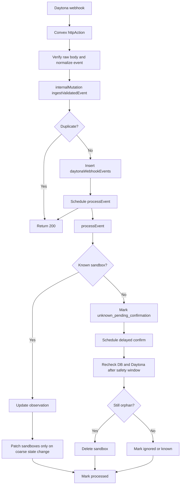

# Plan 09 — Daytona Webhook Reconciliation

- **Priority**: P1
- **Scope**: Daytona sandbox lifecycle webhook ingress, idempotent event handling, orphan-resource detection, retry/replay hardening, and docs sync.
- **Conflicts**:
  - `convex/http.ts`: 與任何 webhook / callback 類改動衝突。
  - `convex/schema.ts`: 若加入 webhook inbox / projection table，會與其他 schema plan 衝突。
  - `convex/{ops,opsNode,daytona}.ts`: 會與 Daytona cleanup / reconciliation 類改動重疊。
- **Dependencies**:
  - 目前的 DB-first provisioning 與 `reconcileDaytonaOrphans` 已存在，這份是其上層 hardening，而不是替代方案。

## 結論

這份計劃的**大方向是對的**：

- webhook 只負責加速收斂，不取代 cron
- 需要 idempotency
- 未知 remote sandbox 不能收到事件就直接刪

但原版還**不完全符合長期最佳實踐**，所以這次先修計劃，不直接實作。主要原因有五個：

1. **journal 寫入與 schedule 必須放在同一個 mutation 裡**，不能分散在 `httpAction` 做，否則 durability 與 retry 邊界不夠清楚。
2. **高頻 provider observation 不應直接一直 patch `sandboxes`**，長期會把 workflow state 與高 churn 狀態混在一起。
3. **缺少 out-of-order 防護**，舊事件不能覆蓋新事件。
4. **缺少 backlog repair / retry / retention 設計**，事件卡住後沒有明確恢復路徑。
5. **Daytona 官方文件目前可確認 event payload，但簽章 / delivery metadata 規格仍不夠穩定**，正式實作要先把驗證抽象化。

## 背景

目前系統對 Daytona orphan 資源的處理，已經有三層：

1. **Prevention**：先在 Convex reserve sandbox row，再呼叫 Daytona create。
2. **Request-path cleanup**：import fail / repository delete 時，排 cleanup job。
3. **Cron reconciliation**：
   - `sweepExpiredSandboxes`
   - `reconcileDaytonaOrphans`

這已經足夠安全，但仍是 **eventual consistency**：

- Daytona state 改變後，要等下一次 request-path 或 cron 才會反映到 Convex。
- webhook 可以更快知道：
  - `sandbox.created`
  - `sandbox.state.updated`
  - 疑似 Daytona-side orphan 的出現

但 webhook **不能取代** cron，因為 webhook 也可能延遲、重送、漏送、驗證失敗，或在 deploy / outage 期間未被處理。

## 目標

做成「**webhook 驅動的快速收斂 + cron 驅動的最終對帳**」：

1. Daytona 事件可即時進入 Convex。
2. webhook handling 必須能安全處理 retry / duplicate / out-of-order。
3. 對「DB 沒有、Daytona 有」的未知 sandbox，webhook 只做**快速發現**，真正刪除仍保留 safety window 與確認步驟。
4. 保留既有 cron，讓 webhook 只是加強，不是單點依賴。
5. 把 orphan-resource 策略明確寫進文件，而不是散落在 code 與口頭知識裡。
6. 避免把高頻 remote observation 直接灌進核心 workflow table，維持可維護性與效能。

## 非目標

- 不把 webhook 當成 Daytona state 的唯一來源。
- 不移除 `reconcileDaytonaOrphans` 或 `sweepExpiredSandboxes`。
- 不要求把 Daytona 每個細狀態都完整映射到前端 UI。
- 不在第一版就處理 snapshot / volume webhook；先聚焦 sandbox。
- 不在第一版就做完整 metrics dashboard；先把事件 durability 與 recovery path 建好。

## 修正版設計

### A. 新增 Daytona webhook endpoint，但只做很薄的 ingress

在 `convex/http.ts` 新增：

- `POST /api/daytona/webhook`

`httpAction` 只做三件事：

1. 讀 raw request body
2. 驗證來源並 parse 成 normalized event
3. 呼叫單一 `internalMutation` 做 transactionally durable ingestion

**不要**在 `httpAction` 直接做：

- DB 狀態更新
- orphan 刪除
- 長邏輯分支

這樣 endpoint 可以快回 `200`，降低 Daytona retry 與 timeout 機率，也讓真正的 durability 邊界集中在 mutation。

### B. 驗證策略要抽象化，不要綁死 undocumented header

優先順序：

1. **若 Daytona 官方正式提供 signing secret 與簽章 header**：
   - 使用 Daytona 提供的正式驗證機制
   - 驗證內容必須基於 raw body
2. **若文件仍未穩定公開簽章格式**：
   - 不要把猜測中的 header 名稱直接寫死到主流程
   - 包一個 helper，例如 `verifyDaytonaWebhook(request, rawBody)`
   - helper 回傳：
     - `verified`
     - `organizationId`
     - `providerDeliveryId?`
     - `normalizedEvent`

若短期內只能先上暫時方案，至少要同時具備：

- HTTPS
- 高熵 endpoint token
- event allowlist
- organization ID allowlist

但這只算暫時方案，不算最終安全模型。

### C. 用「transactional inbox mutation」接事件

新增一個 internal mutation，例如：

- `internal.daytonaWebhook.ingestValidatedEvent`

它負責一次做完：

1. 產生 `dedupeKey`
2. 寫入 `daytonaWebhookEvents`
3. 若是重複事件則直接回傳 `duplicate`
4. 若是新事件則在**同一個 mutation** 裡 `ctx.scheduler.runAfter(0, internal.daytonaWebhook.processEvent, { eventId })`

這比在 `httpAction` 內分開「寫 DB」與「schedule processor」更穩，因為 journal 與後續處理的排程邊界會更清楚。

### D. 把 event inbox 與 provider projection 分開

長期最佳實踐不建議直接把 webhook 的高頻 observation 都 patch 到 `sandboxes`。

建議拆成兩張表：

#### 1. `daytonaWebhookEvents`

用途：

- durable inbox
- idempotency
- retry / replay
- audit / debugging

建議欄位：

- `providerDeliveryId?`
- `dedupeKey`
- `eventType`
- `remoteId`
- `organizationId`
- `eventTimestamp`
- `normalizedState?`
- `payload`
- `status`: `received` / `processing` / `processed` / `ignored` / `retryable_error` / `dead_letter`
- `attemptCount`
- `nextAttemptAt`
- `processingLeaseExpiresAt?`
- `receivedAt`
- `processedAt?`
- `lastErrorMessage?`
- `retentionExpiresAt`

#### 2. `sandboxRemoteObservations`

用途：

- 存 Daytona 端的最新觀測結果
- 隔離高 churn provider state
- 做 out-of-order 防護
- 記錄 unknown remote 的 safety window

建議欄位：

- `remoteId`
- `sandboxId?`
- `repositoryId?`
- `organizationId`
- `lastObservedState`
- `lastObservedAt`
- `lastWebhookAt`
- `lastAcceptedEventAt`
- `discoveryStatus`: `known` / `unknown_pending_confirmation` / `confirmed_orphan` / `deleted` / `ignored`
- `firstSeenAt`
- `confirmAfterAt?`
- `deletedAt?`

`sandboxes` 本體只在必要時 patch 粗粒度狀態，例如：

- `stopped`
- `archived`
- `failed`

而不是每次 `started` / heartbeat 類 observation 都更新。

### E. processor 要先做「claim + stale-event 防護」

新增 internal action，例如：

- `internal.daytonaWebhook.processEvent`

處理邏輯要分成兩段：

1. **claim mutation**
   - 把 event 從 `received` / `retryable_error` 轉成 `processing`
   - 設定 `processingLeaseExpiresAt`
   - 超過 lease 的卡住事件允許後續 repair job 重新撿回
2. **processor action**
   - normalize Daytona state（大小寫、命名差異先收斂成內部 enum）
   - 讀 observation
   - 若 `eventTimestamp <= lastAcceptedEventAt`，直接標 `ignored`
   - 只讓較新的 event 更新 projection

這一步是避免：

- duplicate event 重複生效
- out-of-order event 把較新的狀態蓋掉

### F. 已知 sandbox 的更新原則

以 `remoteId` 查 `sandboxes.by_remoteId`。

若存在：

- `sandbox.created`
  - 通常只更新 observation
  - 不直接改 import pipeline 的主狀態機
- `sandbox.state.updated`
  - `started`
    - 只更新 observation，通常不需要 patch `sandboxes`
  - `stopped`
    - 可提早把 `sandboxes.status` 標成 `stopped`
  - `archived` / `deleted` / `destroyed`
    - 可提早把 `sandboxes.status` 標成 `archived`
  - `error`
    - 更新 observation，必要時標 `failed`

重點不是讓 webhook 接管整個 sandbox workflow，而是讓本地投影更快收斂到 Daytona reality。

### G. 未知 remote sandbox 先記錄，再延遲確認

若依 `remoteId` 查不到 `sandboxes`：

- 不要當下直接刪
- 先把 `sandboxRemoteObservations.discoveryStatus` 設成 `unknown_pending_confirmation`
- 設 `confirmAfterAt = firstSeenAt + safetyWindow`
- 再 schedule 一個延遲確認 action，例如 10 分鐘後

延遲確認動作再做：

1. 再查一次 Convex `sandboxes.by_remoteId`
2. 若仍不存在，再查 Daytona `get(remoteId)` 或 list-by-label
3. 若 Daytona 仍存在，且已超過 safety window，才刪除
4. 成功刪除後標 `confirmed_orphan` / `deleted`

這樣可以避免誤殺：

- webhook 比 `attachSandboxRemoteInfo` 更早到
- import pipeline 只是慢，不是真的 orphan

### H. 保留 cron，但多補兩條 repair/cleanup cron

以下 cron 都應保留或新增：

- 保留 `sweepExpiredSandboxes`
- 保留 `reconcileDaytonaOrphans`
- 新增 `repairDaytonaWebhookBacklog`
- 新增 `cleanupOldDaytonaWebhookEvents`

角色分工：

- **webhook**：低延遲、快速收斂
- **既有 cron**：最終對帳、補 webhook 遺漏
- **backlog repair cron**：撿回卡住或 retryable 的 webhook event
- **retention cleanup cron**：清掉過舊的 processed event，避免 journal 無限成長

### I. 去重鍵與事件排序

若 Daytona 未提供穩定公開的 delivery ID，去重鍵不要綁定 undocumented header。

建議：

- **首選**：官方 delivery/message id（若文件正式公開且可驗證）
- **次選**：`eventType + remoteId + eventTimestamp + normalizedState tuple`

另外一定要保留：

- `eventTimestamp`
- `lastAcceptedEventAt`

因為 dedupe 只能處理「完全重複」，不能處理「順序錯亂」。

## 建議流程圖

## 觀測與告警

至少要加 structured log：

- `daytona_webhook_received`
- `daytona_webhook_duplicate`
- `daytona_webhook_signature_failed`
- `daytona_webhook_claim_failed`
- `daytona_webhook_stale_ignored`
- `daytona_webhook_unknown_remote`
- `daytona_webhook_processed`
- `daytona_webhook_retry_scheduled`
- `daytona_webhook_dead_letter`
- `daytona_orphan_deleted_via_webhook`

若未來有 metrics / dashboard，再補：

- webhook receive count
- verification failure count
- duplicate rate
- stale-event ignore count
- unknown remote count
- retry backlog count
- orphan delete count

## 文件同步要求

這件事要同步三層文件：

### 1. Core docs（描述 current state）

- `docs/system-overview.md`
- `docs/integrations-and-operations.md`

上線後才更新成 current state，不要先把未落地設計寫成既成事實。

### 2. Plan docs（描述 future design）

- 本文件

### 3. System design docs（描述為什麼這樣拆）

- `docs/daytona-webhook-reconciliation-system-design.md`

## 驗證

- 重送同一筆 webhook，不會重複處理
- 舊事件晚到時，不會覆蓋較新的 remote observation
- 無效簽章 / 無效 token 會被拒絕
- 已知 sandbox 的 `sandbox.state.updated` 能快速更新 observation
- `started` 類高頻 observation 不會一直污染 `sandboxes`
- 未知 remote sandbox 不會在 webhook 到達當下被誤刪
- 延遲確認流程會刪掉超過 safety window 且 DB 仍不存在的 Daytona sandbox
- processor 卡住後，backlog repair cron 能重新撿回事件
- processed journal 會被 retention cleanup 清理，不會無限成長
- 即使停掉 webhook，既有 cron 仍能最終清掉 orphan

## Out of Scope

- 不處理 Daytona snapshot / volume webhook
- 不把 Daytona 全部 lifecycle 細節都映射到前端
- 不把 cron 拔掉
- 不在這份計劃裡決定 Daytona 官方最終簽章格式
