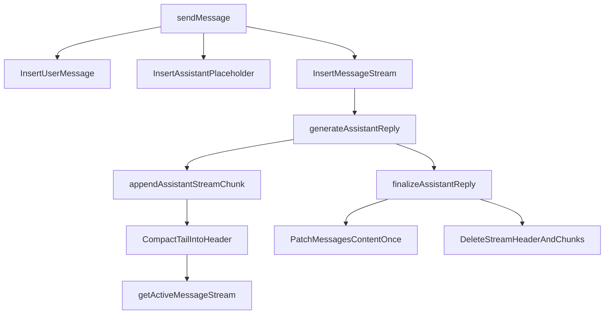
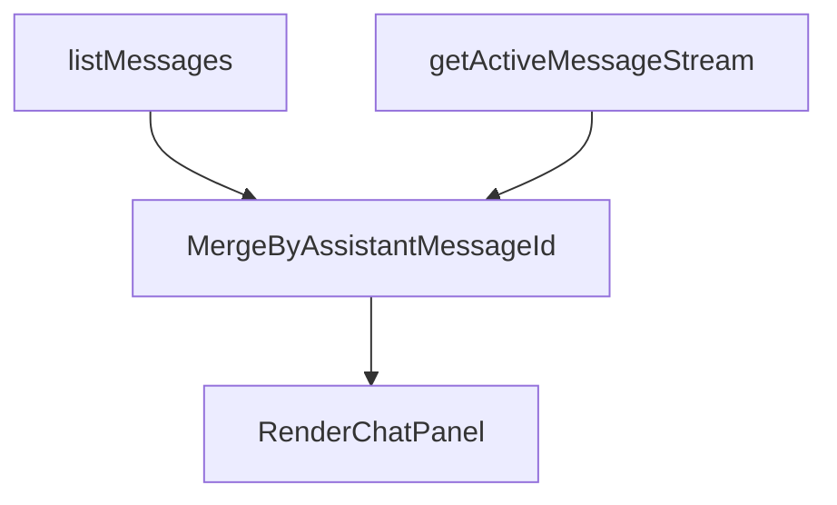
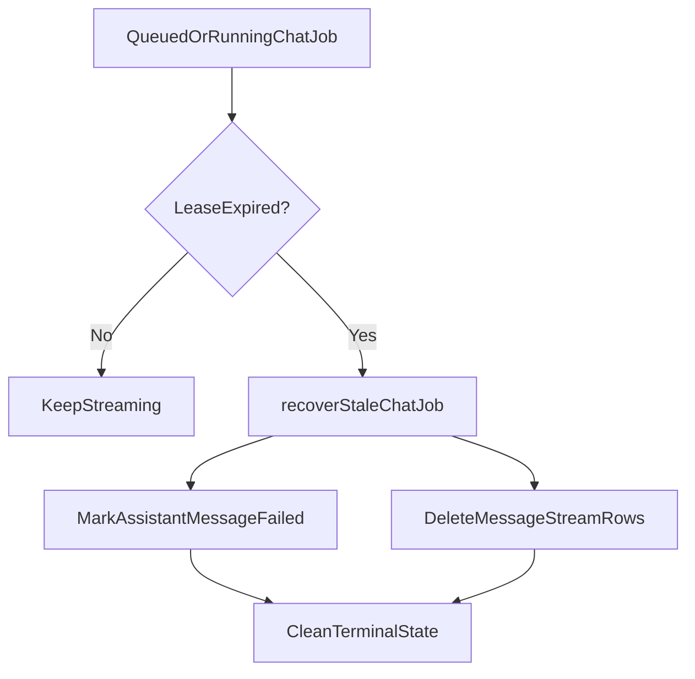

# Streaming Reply Optimization System Design

## Purpose

This document explains the long-term streaming architecture now used by Repospark chat.

The design separates:

- durable chat history
- high-frequency in-flight stream state

That split improves maintainability, failure recovery, and streaming performance at the same time.

## The Problem

The old design streamed directly into `messages.content`.

That meant one `messages` row had to serve two very different jobs:

1. a stable historical record for the thread
2. a hot write target for every streamed delta

This created predictable pressure:

- every flush rewrote a growing string
- every flush re-invalidated `listMessages`
- stable history and hot stream state had no clean boundary

## Design Goals

The long-term design optimizes for five properties:

1. keep durable history and hot streaming state separate
2. make high-frequency writes small and bounded
3. keep the UI live without reloading the whole chat history query
4. make stale-job recovery leave no orphan stream state behind
5. keep the steady-state model simple enough to reason about

## Chosen Design

The system now uses three layers:

- `messages` for durable chat history
- `messageStreams` for one active stream header
- `messageStreamChunks` for append-only stream tail chunks

The key rule is:

> `messages.content` is only written at terminalization time, not on every delta.

## Data Model

### Durable layer

`messages` stays the source of truth for:

- chronological chat history
- final assistant content
- coarse status transitions such as `pending`, `streaming`, `completed`, and `failed`

### Hot layer

`messageStreams` stores one active stream row per in-flight assistant reply:

- `assistantMessageId`
- `compactedContent`
- `compactedThroughSequence`
- `nextSequence`
- timing metadata

`messageStreamChunks` stores the append-only tail:

- `streamId`
- `sequence`
- `text`

## Runtime Flow

## Why Compaction Exists

If every delta stayed forever in `messageStreamChunks`, the active-stream query would eventually become expensive again.

So the design periodically compacts the oldest tail chunks into `messageStreams.compactedContent`.

That gives the system a useful balance:

- appends stay small and cheap
- the active query stays bounded
- finalization can still reconstruct the full answer reliably

## Frontend Read Boundary

The UI now reads two sources:

`listMessages` is now responsible for stable history and placeholder rows.

`getActiveMessageStream` is responsible only for the live in-flight assistant text.

This prevents the whole history query from becoming the transport mechanism for every streamed delta.

## Failure Recovery

The cleanup rule is simple:

- if a reply completes, durable content is written and hot state is deleted
- if a reply fails or stalls, the durable row is marked failed and hot state is deleted

That prevents orphan `messageStreams` or `messageStreamChunks` from accumulating after failures.

## Why This Fits Convex Better

This design avoids two poor fits for Convex:

1. repeatedly rewriting a growing hot document
2. storing an unbounded array on one document

Instead, it uses:

- a stable durable row
- bounded append-only child rows
- explicit cleanup and compaction

That is a better match for Convex's document model and reactive invalidation behavior.

## Trade-Offs

The trade-off is extra moving parts:

- more tables
- more lifecycle code
- a UI merge step

That added complexity is deliberate, because it buys:

- lower write amplification
- lower history-query invalidation frequency
- cleaner stale-job cleanup
- a more maintainable steady-state boundary

## Result

The result is a cleaner long-term architecture:

- `messages` remains readable durable history
- the active stream is isolated to a dedicated hot surface
- final assistant content is written once
- the UI stays live without turning the whole history query into a stream transport layer
