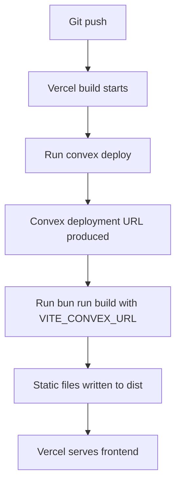
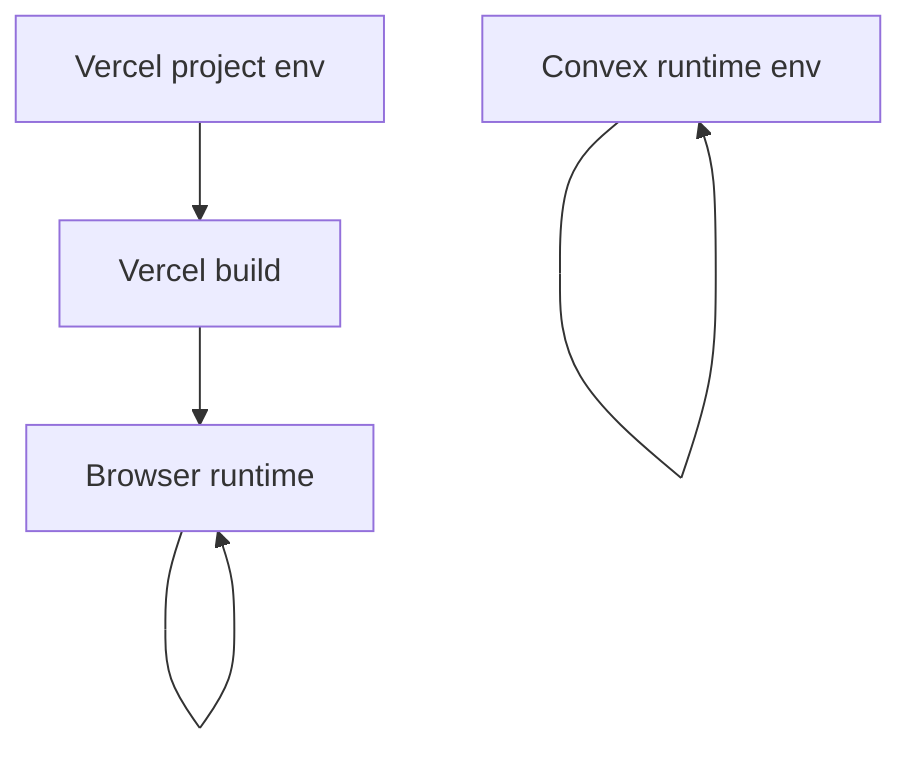
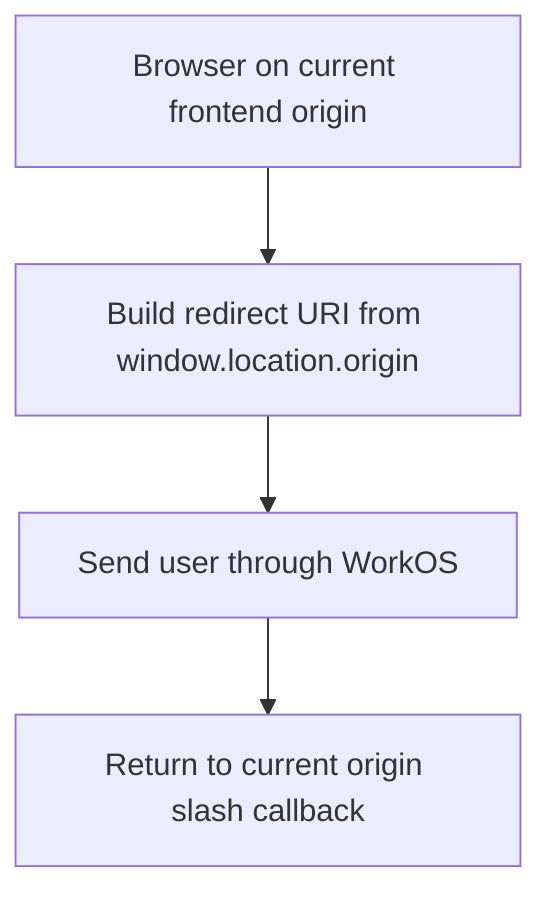
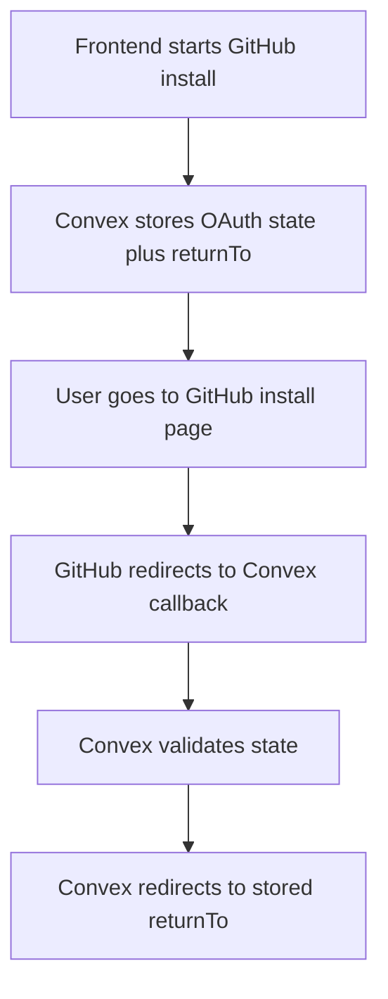

# Vercel + Convex Deployment System Design

## Purpose

This document explains the long-term deployment shape for Repospark when the frontend is hosted on Vercel and the backend runs on Convex.

The goal is to keep deployment:

- simple to operate
- safe across preview and production
- clear about who owns each environment variable and callback URL

## Why This Needs A Design

At first glance, the deployment model looks simple:

- Vercel builds the frontend
- Convex deploys the backend
- the app becomes available

But there are two easy places to create long-term drift:

1. mixing browser callback URLs with server callback URLs
2. duplicating domain logic across Vercel env, frontend code, and Convex runtime env

If those concerns are not separated early, preview deployments become fragile and operators end up manually patching URLs.

## Design Goals

The deployment design should optimize for:

1. one simple CD path
2. separate preview and production isolation
3. minimal manual environment maintenance
4. clear ownership of public vs secret configuration
5. correct callback behavior for both browser auth and server callbacks

## Core Decisions

### 1. Vercel owns hosting and deploy triggers

Vercel should be the system that:

- watches Git pushes
- creates preview and production deployments
- serves the static frontend

This keeps CD simple and avoids adding another orchestration layer too early.

### 2. Convex deploy runs inside the Vercel build

The recommended build path is:

```bash
bunx convex deploy --cmd 'bun run build' --cmd-url-env-var-name VITE_CONVEX_URL
```

This keeps the deployed Convex URL and the built frontend bundle in the same pipeline.

### 3. Preview and production must be isolated

Preview and production should never share the same `CONVEX_DEPLOY_KEY`.

That isolation protects against the most dangerous failure in this setup:

- a preview build accidentally deploying to production Convex

### 3-1. The repository should declare Bun explicitly

Because this repo already carries Bun-based CI and a `bun.lock`, the root `package.json` should also declare:

- `packageManager: bun@1.3.10`

This is not just cosmetic. It reduces ambiguity when build platforms choose a package manager and helps avoid accidental fallback to npm-style behavior when multiple lockfiles exist.

### 4. Browser callback URLs should come from browser origin

For browser-side auth, the frontend already knows where it is running.

That means the cleanest rule is:

- browser callback URL = `window.location.origin + '/callback'`

This is simpler than injecting branch-domain values into the frontend bundle.

### 5. Server callback redirects should come from the initiating request

GitHub App installation redirects arrive at Convex, not at the frontend.

Because of that, any single global frontend URL is not a strong enough source of truth when preview deployments matter.

The safer rule is:

- when install starts, store the frontend origin with the OAuth state
- when GitHub returns, validate the state
- redirect back to the stored origin

## Main Deployment Flow




## Configuration Ownership




Use that split like this:

- **Vercel project env**
  - `CONVEX_DEPLOY_KEY`
  - `VITE_WORKOS_CLIENT_ID`
- **Vercel system env exposed to build**
  - `VERCEL_BRANCH_URL`
  - `VERCEL_PROJECT_PRODUCTION_URL`
- **frontend runtime**
  - current origin for browser callback URLs
- **Convex runtime env**
  - secrets such as GitHub, Daytona, and OpenAI credentials

## Callback Design

### WorkOS browser callback




This keeps local development, preview, and production on the same simple rule.

### GitHub App installation callback




This avoids having preview correctness depend on a manually managed global frontend URL.

## Operational Guardrails

The deployment setup should keep these rules:

- expose Vercel system environment variables to the build
- use `rewrites` for SPA deep-link fallback
- keep secrets out of frontend env
- keep GitHub Actions as CI-only unless there is a real release-orchestration need
- if no valid state exists, return an explicit callback error instead of guessing a frontend URL

## Result

This design keeps the deployment model small without hiding important boundaries:

- Vercel remains the single CD entrypoint
- Convex remains the backend and deploy target
- preview and production stay isolated
- callback routing stays correct without manual branch-by-branch URL maintenance

That is the best long-term fit for Repospark's current architecture.